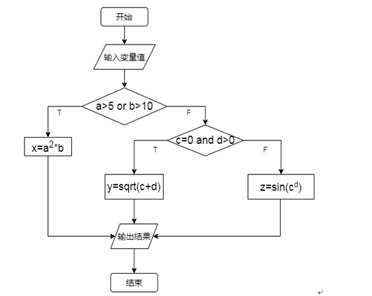
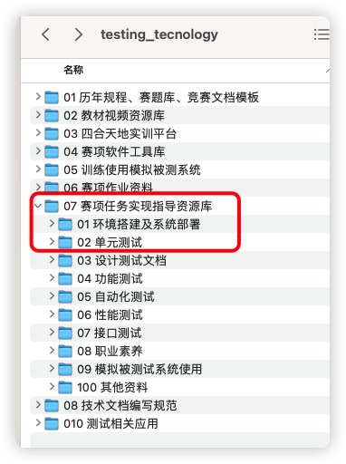

# 软件测试赛答辩题目任务书

任务题目：环境搭建及单元测试测试题

指导老师：冼世和

集训小组：

## 一、任务的意义

1 学会使用**VirtualBox**安装**CentOS**并进行环境搭建

2 学会使用JUnit进行单元测试

## 二、任务的内容

### **（一）、环境搭建及单元测试的地址及账号信息**

1 仓库管理系统地址：
http://124.221.224.47:8084/

2 账号密码：
administrator
administrator123

### **（二）、环境搭建**

**第一题：安装VirtualBox软件及安装CentOS系统**

本部分按照环境搭建及系统部署要求文档，安装VirtualBox虚拟机软件，并在VirtualBox里安装Centos操作系统；安装过程截图。截图需粘贴在环境搭建试报告中。环境搭建具体要求如下：

1、下载并安装VirtualBox:

访问官网下并安装VirtualBox，具体要求如下:

（1） VirtualBox官网：https://www.virtualbox.org/。

（2）在自己电脑上安装VirtualBox，版本为6.1.18。

（3） 截图要求：一共1张图：①VirtualBox安装完成结果截图。

2、安装CentOS系统。

使用VirtualBox安装CentOS操作系统，具体要求如下：

（1） 下载CentOS系统镜像。

​			①下载链接：https://pan.baidu.com/s/1YJdh5XAoZC9pEWEkJdJvzQ 提取码：test 

（2） 使用VirtualBox安装CentOS操作系统

​			① 新建虚拟机，类型选择Linux

​			② 分配虚拟机内存，建议2G及以上

​			③ 创建虚拟硬盘，建议20G及以上

​			④ 选择所下载的系统镜像进行安装

（2） 截图要求：一共3张图：① 分配虚拟机内存截图；②创建虚拟硬盘截图，③系统安装完成截图。

**第二题：配置环境**

本部分按照环境搭建及系统部署要求文档，完成JDK、MySQL、Tomcat等测试环境搭建与配置，并最终能通过浏览器成功访问系统，过程与结果需截图。截图需粘贴在环境搭建及系统部署报告中。环境搭建具体要求如下：

**（1）安装配置JDK要求说明：** 

1、在CentOS系统中，使用提供的JDK安装包，安装JDK。

2、安装成功后，查看JDK版本信息。

3、截图要求：一共2张图，分别为：①JDK环境变量配置截图；②查看JDK版本信息截图。

 

**（2）安装配置MySQL要求说明：** 

1、在CentOS系统中，使用提供的MySQL安装包，安装MySQL。

2、将MySql的root账号密码修改为：root。

3、MySQL安装成功后，初始化人力资源综合服务系统数据库。

4、截图要求：一共2张图：①root账号成功登录MySQL截图；②初始化人力资源综合服务系统数据库命令截图

 

**（3）安装配置Tomcat要求说明：** 

1、在CentOS系统中，使用提供的Tomcat安装包，安装Tomcat。

2、Tomcat安装成功后，通过宿主机的浏览器访问Tomcat主页。

3、截图要求：一共2张图：①成功启动Tomcat服务截图；②通过浏览器访问Tomcat主页截图。

### **（三）、单元测试**

1 概述

按照单元测试文档要求，执行单元测试；使用JUnit框架对应用程序编写单元测试代码，使用设计的测试数据完成单元测试，对测试数据及相应测试结果进行界面截图，将代码以及相关截图粘贴到单元测试报告中。

2 题目要求

​		根据下列流程图编写程序实现相应分析处理，并设计最少的测试数据进行判定条件覆盖测试。输入数据打印出“输入a值:”、“输入b值:”、“输入c值:”、“输入d值:”。x执行结果输出文字“x的值:”和x的值，y执行结果输出文字“y的值:”和y的值；z执行结果输出文字“z的值:”和z的值。其中变量a、b、c、d均须为整型。

​		使用JUnit框架编写单元测试代码，使用设计的的测试数据进行测试，使用断言判断返回结果值是否正确。

## 三、提交成果

根据题目要求，填写完成环境搭建及单元测试的实现报告。

## 四、参考文献

1 参考理论教材中，本任务相关知识点

链接：https://pan.baidu.com/s/1IgFd8NERaJQ_iwqX_G8iSA 
提取码：test 

2 参考视频教材中，本任务相关知识点

链接：https://pan.baidu.com/s/1UrXySbyYGXg7wHnvaF19lA 
提取码：test 

3 找以下位置的环境搭建和单元测试的所有相关文档

