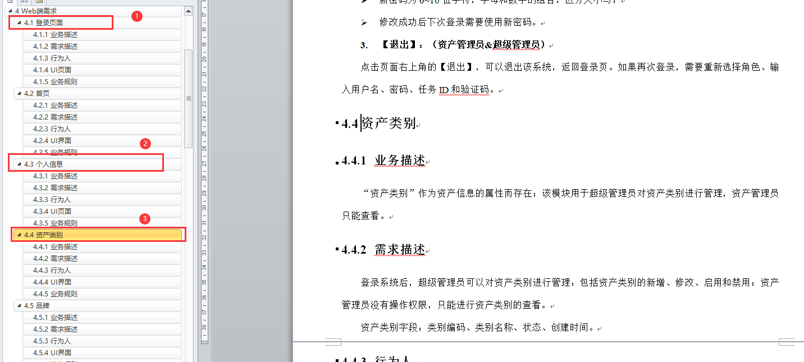

# 软件测试赛测试文档及功能测试任务书

任务题目：测试文档及功能测试

指导老师：李达宇

集训小组：A、B、C、D组（轮流执行）

## 一、任务的意义

1 学会使用如何编写测试计划和测试测试总结文档

2 学会根据需求说明书，快速写出测试用例，了解如何执行测试用例检测系统的bug

## 二、任务的内容

### （一）、编写测试计划和测试总结

根据以下文件：

> - A7-BS 资产管理系统需求说明书.doc
> - A5-测试计划模板.doc
> - A6-测试总结报告模板.doc

结合参考文献的文档、教学视频等资源，根据模板的格式要求，独立完成《A5-测试计划》和《A6-测试总结报告的编写》

### （二）、编写测试用例

使用模板《A8-功能测试用例模板.xls》

根据《A7-BS 资产管理系统需求说明书.doc》，编写以下模块的测试用例并填写A8-功能测试用例文件

> - 4.1 登录页面
> - 4.3 个人信息
> - 4.4 资产类别

## 三、提交成果

根据题目要求，填写完成本任务的实现报告。

## 四、参考文献

1 参考理论教材中，功能测试相关知识点

链接：https://pan.baidu.com/s/1IgFd8NERaJQ_iwqX_G8iSA 
提取码：test 

2 参考视频教材中，功能测试相关知识点

链接：https://pan.baidu.com/s/1UrXySbyYGXg7wHnvaF19lA 
提取码：test 

3 找以下位置的功能测试实现所有相关文档

> testing_tecnology\07 赛项任务实现指导资源库\04 功能测试
>

