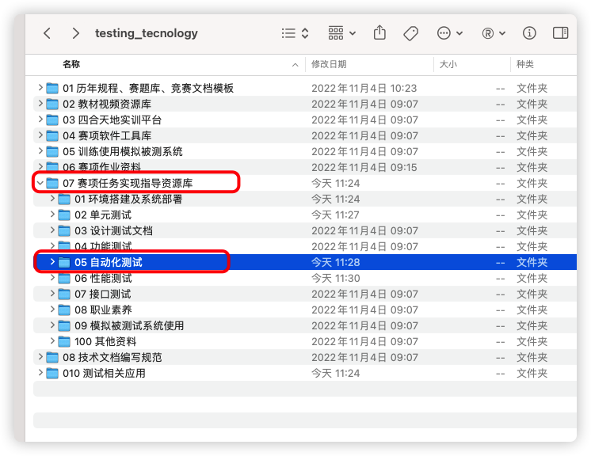

# 软件测试赛答辩题目任务书

任务题目：自动化试测试题

指导老师：冼世和

集训小组：所有小组

## 一、任务的意义

1 学会**PyCharm中进行自动化测试脚本编写，并执行脚本**

## 二、任务的内容

### **（一）、环境搭建及单元测试的地址及账号信息**

1 仓库管理系统地址：
http://124.221.224.47:8084/

2 账号密码：
administrator
administrator123

### **（二）、环境搭建**

**第一题：按照以下步骤在PyCharm中进行自动化测试脚本编写，并执行脚本**

本部分按照自动化测试要求撰写文档，执行自动化测试，对页面元素进行识别和定位、编写自动化测试脚本、成功执行脚本并将脚本粘贴在自动化测试报告中。环境搭建具体要求如下：

1、从Selenium中引入WebDriver；

2、使用Selenium模块的WebDriver打开谷歌浏览器；

3、在谷歌浏览器中通过get方法发送网址打开资产管理系统登录页面；

4、查看登录页面中的用户名输入框元素，通过id属性定位用户名输入框，并输入用户名student；

5、查看登录页面中的密码输入框元素，通过tag_name属性定位密码输入框，并输入密码student；

6、查看登录页面中的登录按钮元素，通过css_selector方法定位登录按钮，使用click()方法点击登录按钮进入资产管理系统首页。

**第二题：按照以下步骤在PyCharm中进行自动化测试脚本编写，并执行脚本。**

本部分按照自动化测试要求撰写文档，执行自动化测试，对页面元素进行识别和定位、编写自动化测试脚本、成功执行脚本并将脚本粘贴在自动化测试报告中。环境搭建具体要求如下：

1、从Selenium中引入WebDriver；

2、使用Selenium模块的WebDriver打开谷歌浏览器；

3、将浏览器窗口最大化；

4、在谷歌浏览器中通过get方法发送网址打开资产管理系统登录页面；

5、增加智能时间等待30秒；

6、查看登录页面中的用户名输入框元素，通过name  属性定位用户名输入框，并输入用户名student；

7、查看登录页面中的密码输入框元素，通过name属性定位密码输入框，并输入密码student；

8、查看登录页面中的登录按钮元素，通过tag_name方法定位登录按钮，使用click()方法点击登录按钮进入资产管理系统首页；

9、在资产管理系统首页查看左侧供应商按钮元素，通过link_text方法进行定位。

10、 使用select()方法中的select_by_value()方式选中左侧状态选择框中的“已启用”；

## 三、提交成果

根据题目要求，填写完成本任务的实现报告。

## 四、参考文献

1 参考理论教材中，本任务相关知识点

链接：https://pan.baidu.com/s/1IgFd8NERaJQ_iwqX_G8iSA 
提取码：test 

2 参考视频教材中，本任务相关知识点

链接：https://pan.baidu.com/s/1UrXySbyYGXg7wHnvaF19lA 
提取码：test 

3 找以下位置的环境搭建和单元测试的所有相关文档

