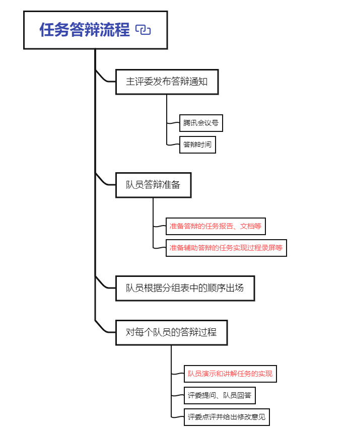

# 2022-203-1学期软件测试集训队11-12月份任务安排

根据比赛的备赛进程，对集训队11-12月份的备赛任务作如下安排：

## 一、队员分组

## 二、各小组任务安排

## 三、答辩式任务训练

本比赛项目共有四个任务题目，分别是：

> - 功能测试、技术文档
> - 负责性能、接口测试
> - 单元测试、环境搭建
> - 自动化测试

根据比赛备赛的实际需要，队伍采用分组完成项目方式完成。

每组内的队员，**在一个答辩周期(即两周内)只需要完成本小组对应的任务**。

**在每个备赛周期结束，每个队员要参加任务答辩**，答辩流程如下：

## 四、任务资料

（一）、04 答辩式项目任务训练题目.rar 

队伍训练任务资料包

（二）testing_tecnology.rar  

软件测试技术资料包

（三）markdown编辑器typora

